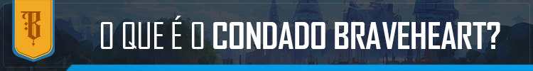
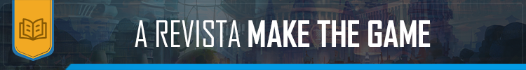
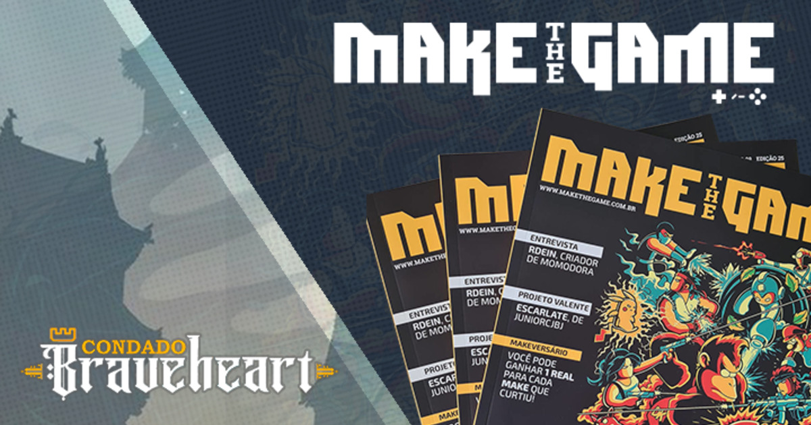

# revista

## revista Make the Game do fórum Condado Braveheart
  
  

<a href="https://condadobraveheart.com/" target="_blank" rel="external" 
title="Condado é uma comunidade"><strong>Condado é uma comunidade</strong></a>

O Condado é uma comunidade com milhares de membros, voltada para apoiar o desenvolvimento de jogos independentes e de todas as outras criações artísticas envolvidas em sua criação, como escrita, programação, música e arte digital.
Fundada em 2009, a comunidade evoluiu e se transformou ao longo dos anos, e hoje conta com um fórum e portal de notícias, um servidor no Discord, um canal no Youtube e uma revista focada no desenvolvimento de jogos - a Make The Game.

  

### Participei como colaborador e redator em algumas edições a partir da edição nº 11

  

A revista Make the Game, MTG para os íntimos, é uma publicação trimestral focada no universo do desenvolvimento de jogos. Com seções dedicadas a arte, roteiro, sonoplastia, programação e game design, não falta conteúdo de qualidade para você que ama desenvolver ou descobrir um pouco mais sobre como os jogos são feitos.
Todas as edições publicadas até agora estão disponíveis gratuitamente para serem baixadas no <a href="https://makethegame.com.br/" target="_blank" rel="external" 
title="site da revista"><strong>site da revista</strong></a>. 

